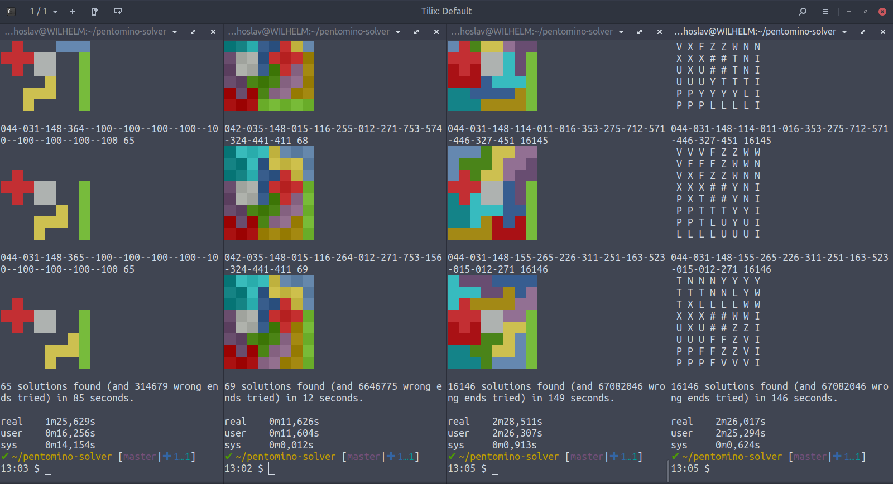

Fork of Pentomino Solver by Marc Lepage

Edited to be able to find only solutions of pentomino with specific chess pattern.

Also additional setting possible:

following environment variables accepted:
  - `CENTER_SQUARE=1` - only find solutions with square in center
  - `CHESS_PATTERN=1` - only find solutions for pieces with chess patern
  - `COLOR_OUTPUT=1` - output colored board insted of letters
  - `SHOW_TRIES=1` - output failure points as well

